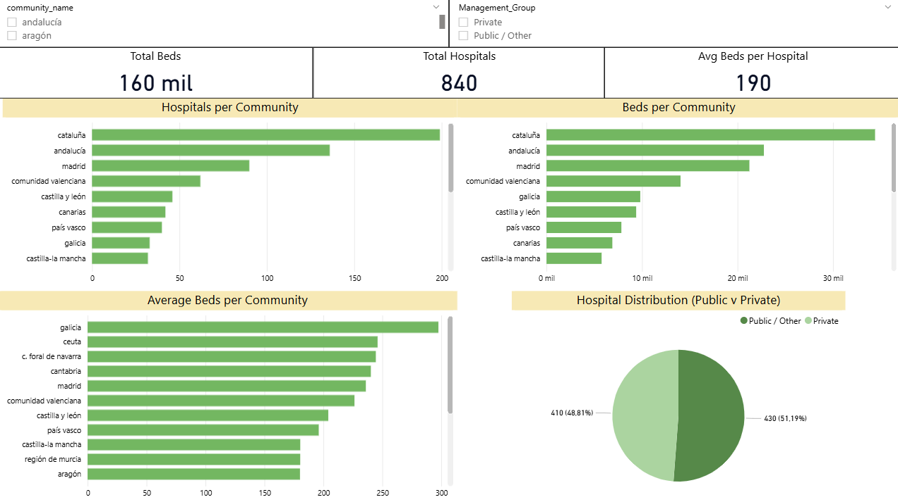
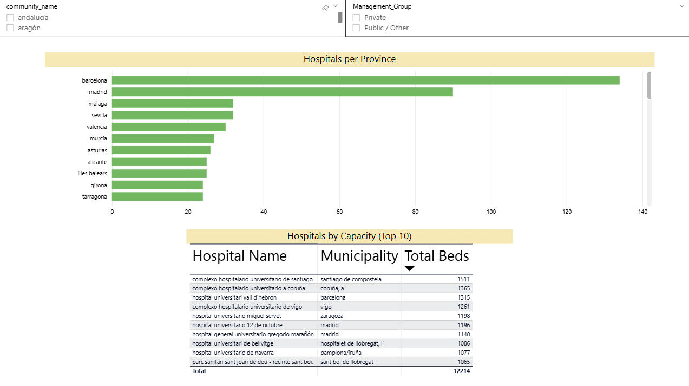

# 🏥 Hospital Capacity Analysis (Spain)

## 📌 Project Overview

This project analyses hospital capacity across Spain using data from the Spanish Ministry of Health from 2024.

It demonstrates an end-to-end data workflow:

* Data cleaning with Python
* Relational database design in MySQL
* Analytical querying with SQL
* Interactive dashboard creation in Power BI

The goal is to uncover insights into:

* Regional distribution of hospitals
* Hospital capacity (beds)
* Public vs private infrastructure
* Largest hospitals in the country

---

## ⚙️ Tech Stack

* **Python** (pandas) → data cleaning & preprocessing
* **MySQL** → database design & querying
* **Power BI** → dashboard & visualisation
* **Jupyter Notebook** → exploration & validation

---

## 📂 Project Structure

```
├── dashboard/        # Power BI dashboard + images
├── data/
│   ├── raw/          # Original dataset
│   └── cleaned/      # Cleaned dataset (CSV)
├── notebooks/        # Exploration & analysis
├── scripts/          # Data cleaning pipeline
├── sql/              # Database + analysis queries
├── README.md
```

---

## 🔄 Data Pipeline

```
Raw Excel Data
    ↓
Python Cleaning Script
    ↓
Clean CSV Output
    ↓
MySQL Database (Star Schema)
    ↓
SQL Analysis (Views + Queries)
    ↓
Power BI Dashboard
```

---

## 🧹 Data Cleaning

Implemented in:

```
scripts/data_cleaning.py
```

Key steps:

* Standardised column names (snake_case)
* Renamed fields for clarity
* Handled missing values
* Converted data types
* Removed redundant columns
* Added validation checks

---

## 🗄️ Database Design

A **star schema** was implemented:

* Fact table:

  * `hospitals`

* Dimension tables:

  * `communities`
  * `provinces`
  * `management_types`
  * `center_types`

---

## 📊 SQL Analysis

Main logic defined in:

```
sql/analysis_queries.sql
```

Includes:

* Hospitals per region
* Beds per region
* Average beds per hospital
* Public vs private distribution
* Top 10 largest hospitals

A reusable view was created:

```
hospital_full_data
```

---

## 📈 Dashboard (Power BI)

The dashboard presents:

* Total hospitals, beds, and averages
* Regional comparisons
* Capacity distribution
* Public vs private breakdown
* Top hospitals by size

### Preview




---

## 🚀 How to Run

### 1. Python (Data Cleaning)

```bash
pip install -r requirements.txt
python scripts/data_cleaning.py
```

---

### 2. MySQL Setup

Run in order:

```sql
create_schema.sql
create_tables.sql
load_data.sql
analysis_queries.sql
```

Or import:

```
sql/dump.sql
```

---

### 3. Power BI

* Open:

```
dashboard/hospital_capacity.pbix
```

* Connect to local MySQL instance if needed

---

## 📌 Key Insights

* Hospital distribution is uneven across regions
* Larger urban areas have significantly higher capacity
* Public hospitals dominate overall infrastructure
* Significant variation exists in average hospital size

---

## 📜 Data Source

Spanish Ministry of Health
**Catálogo Nacional de Hospitales (2024)**

---

## 👤 Author

David Saridakis
