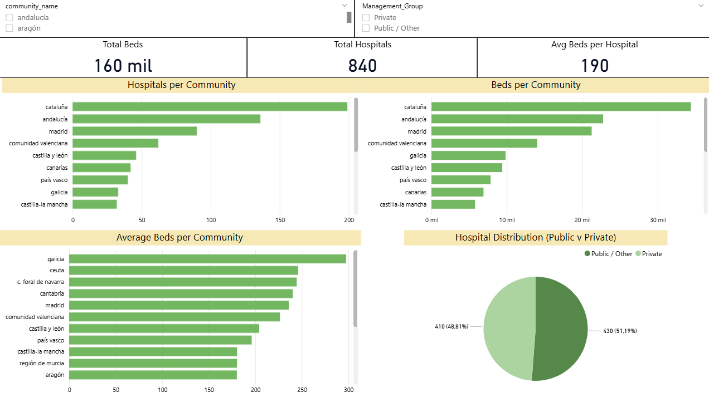
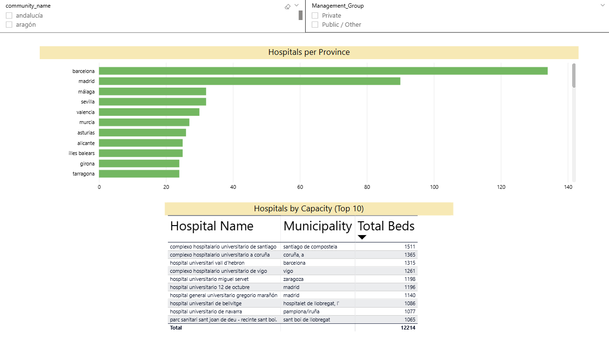

# 🏥 Hospital Capacity Analysis (Spain)

## Exploring Healthcare Infrastructure Through Public Data

### Project Overview

After moving to Spain, I became curious about how healthcare infrastructure is distributed across the country.

The Spanish Ministry of Health publishes detailed information on every registered hospital, making it an interesting dataset for exploring regional healthcare capacity. Rather than using it simply to create a dashboard, I wanted to build a complete analytical workflow that transformed raw public data into meaningful reporting.

The project became an opportunity to strengthen my Power BI skills while also demonstrating the wider analytics process. Instead of importing the data directly into a visualisation, I cleaned and validated it in Python, modelled it in a relational database, answered analytical questions using SQL and finally presented the findings through an interactive dashboard.

---

# Questions Explored

Throughout the analysis I explored questions such as:

- How are hospitals distributed across Spain's autonomous communities?
- Which regions have the greatest hospital bed capacity?
- How does public healthcare infrastructure compare with private provision?
- Where are Spain's largest hospitals located?

The objective was not to evaluate healthcare performance, but to demonstrate how publicly available data can be transformed into structured reporting that supports exploration and comparison.

---

# Analytical Workflow

```
Public Healthcare Dataset
            ↓
Data Cleaning & Validation
            ↓
Relational Database Design
            ↓
SQL Analysis
            ↓
Power BI Dashboard
```

Each stage builds on the previous one, transforming raw government data into an interactive reporting tool.

---

# About the Dataset

This project uses the **Catálogo Nacional de Hospitales (2024)** published by the Spanish Ministry of Health.

The dataset contains information on hospitals throughout Spain, including location, ownership, management type and bed capacity.

Although the data is publicly available, it required cleaning, standardisation and restructuring before it could be analysed effectively.

---

# Technical Workflow

The project intentionally demonstrates the same analytical workflow across several technologies, with each tool contributing a different stage of the analysis.

- **Python** was used for data cleaning, preprocessing and validation.
- **MySQL** was used to design a relational database and store the cleaned dataset.
- **SQL** was used to answer analytical questions through reusable queries and views.
- **Power BI** recreated the reporting layer through an interactive dashboard.

Rather than focusing on a single tool, the project demonstrates how different technologies work together within an analytics workflow.

---

# Data Cleaning

The preprocessing pipeline was implemented in:

```
scripts/data_cleaning.py
```

Key transformations included:

- Standardising column names
- Renaming fields for clarity
- Handling missing values
- Converting data types
- Removing redundant fields
- Performing validation checks

---

# Database Design

A star schema was implemented to support efficient reporting.

### Fact Table

- `hospitals`

### Dimension Tables

- `communities`
- `provinces`
- `management_types`
- `center_types`

---

# SQL Analysis

The primary reporting queries are contained in:

```
sql/analysis_queries.sql
```

The analysis includes:

- Hospitals by autonomous community
- Hospital beds by region
- Average beds per hospital
- Public versus private distribution
- Largest hospitals in Spain

To simplify reporting, a reusable SQL view was created:

```
hospital_full_data
```

---

# Dashboard

The final stage of the project was recreating the SQL analysis within Power BI.

The dashboard is organised into two reporting pages.

## National Overview

- High-level KPIs
- Regional hospital distribution
- Hospital bed capacity
- Public vs private infrastructure



---

## Capacity Analysis

- Average hospital size
- Largest hospitals in Spain
- Regional comparisons
- Supporting operational visuals



---

# Project Structure

```text
.
├── dashboard/
│   ├── hospital_capacity.pbix
│   └── dashboard images
│
├── data/
│   ├── raw/
│   └── cleaned/
│
├── notebooks/
│
├── scripts/
│   └── data_cleaning.py
│
├── sql/
│   ├── create_schema.sql
│   ├── create_tables.sql
│   ├── load_data.sql
│   ├── analysis_queries.sql
│   └── dump.sql
│
├── requirements.txt
└── README.md
```

---

# Key Findings

- Hospital infrastructure is unevenly distributed across Spain.
- Larger urban regions contain both more hospitals and significantly greater bed capacity.
- Public hospitals account for the majority of healthcare infrastructure.
- Average hospital size varies considerably between regions.

---

# What I Learned

One of the most valuable parts of this project was working with a real government dataset rather than one prepared specifically for analysis.

Before any dashboard could be built, the data needed to be cleaned, validated and organised into a structure suitable for reporting. It reinforced that effective visualisations are built on good data modelling, and that Python, SQL and Power BI each play a different role in transforming raw data into useful information.

It also strengthened my understanding of how to move beyond simply creating dashboards and instead build an end-to-end analytics workflow.

---

# Data Source

**Spanish Ministry of Health**

*Catálogo Nacional de Hospitales (2024)*